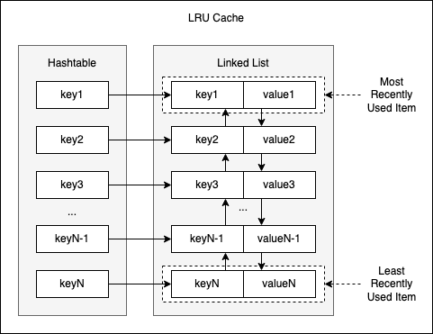

# Introduction
Designing a LRU Cache.

## Required Time Complexity
Insertion / Put - $O(1)$

Get / Retrieve - $O(1)$
## Ideation

With doubly linked lists, we could keep track of item usages in constant time. We could simply move the item we currently access to the top of the list. In a natural way, least used items end up being at the very bottom of the list and we would get a list ordered by item usage as we go. Since we need to relink our items, it would be helpful to have reference to the previous and next items on the list.

Hence, we opt for doubly linked lists so that we can unlink a node at $O(1)$ time.

Nevertheless, doubly linked lists don't meet our requirements completely. It would take us $O(n)$ in order to find and retrieve item by key. This is a sad complexity for cache storages.

To sum up, hashtables luck the advantages of linked lists and linked lists luck advantages of hashtables. We find to find a way to combine hashtables and linked lists such that we meet our LRU cache requirements.

